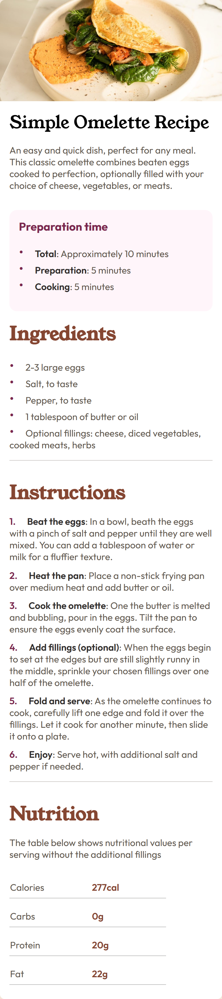
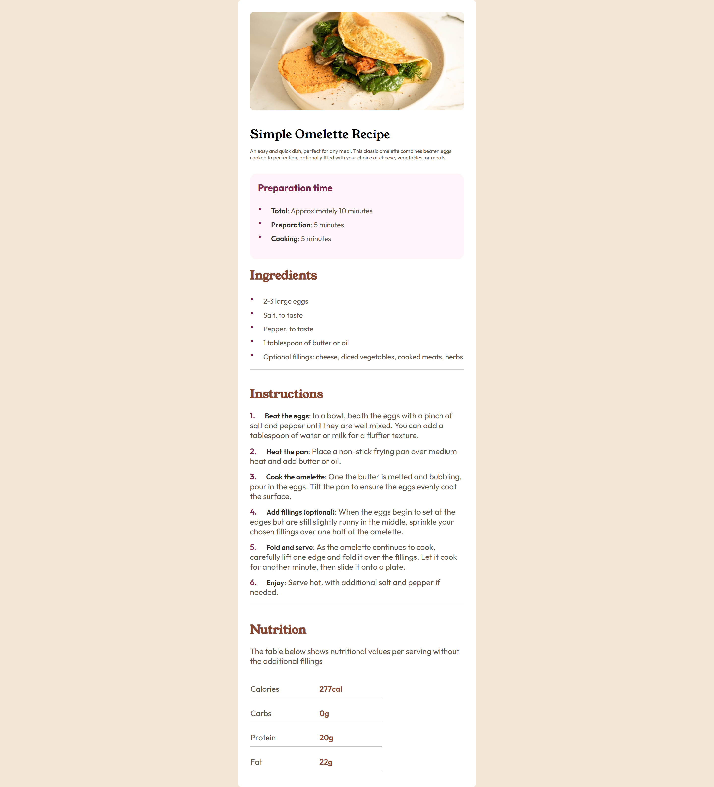

# Frontend Mentor - Recipe Page solution


[Spanish version](README_es.md)

This is a solution to the [Recipe page on Frontend Mentor](https://www.frontendmentor.io/challenges/recipe-page-KiTsR8QQKm). Frontend Mentor challenges help you improve your coding skills by building realistic projects.

## Table of contents

- [Overview](#overview)
  - [Mobile](#mobile)
  - [Desktop](#desktop)
  - [Links](#links)
- [My process](#my-process)
  - [Built with](#built-with)
  - [What I learned](#what-i-learned)

## Overview

### Mobile



### Desktop



### Links

- Live Site URL: [Live on GitHub.io](https://alchrdev.github.io/recipe-page/)

## My process

### Built with

- Semantic HTML5 markup
- CSS custom properties
- CSS Grid
- Mobile-first workflow

### What I learned

I learned about the use of the css property `counter-reset` and `counter-increment`. This was necessary to perform the "trick" when styling the ordered list. Since they, as well as the unordered ones, do not have an option to change their color and size. And of course, it was also thanks to the pseudoelement `::before`.

To do this I thought of several ways, including the one of "simulating" them by using `span` or `div`. However, in the end I decided for the method mentioned above. Was it the "right choice"? I would like to read your suggestions or other possible solutions.


```html
<ul class="recipe-preparation__list">
  <li class="recipe__bullets"></li>
  <li class="recipe__bullets"></li>
  <li class="recipe__bullets"></li>
  <li class="recipe__bullets"></li>
  <li class="recipe__bullets"></li>
</ul>

<ol class="recipe-instructions__list">
  <li class="recipe__numbers"></li>
  <li class="recipe__numbers"></li>
  <li class="recipe__numbers"></li>
  <li class="recipe__numbers"></li>
  <li class="recipe__numbers"></li>
</ol>
```

```css
.recipe-instructions__list {
  counter-reset: item;
}

.recipe__bullets,
.recipe__numbers {
  color: var(--neutral-wenge-brown);
  list-style-type: none;
}

.recipe__bullets::before {
  content: '•';
  color: var(--primary-dark-raspberry);
  display: inline-block;
  block-size: 1.3rem;
  margin-right: 1rem;
  font-size: 1.5rem;
}

.recipe__numbers::before {
  counter-increment: item;
  content: counter(item) '.';
  color: var(--primary-dark-raspberry);
  block-size: 1.3rem;
  margin-inline-end: 1rem;
  font-size: 1rem;
  font-weight: 600;
}
```

### Continued development

- I'm not yet comfortable naming custom properties. I want to be able to follow some sort of "standard" and be able to replicate it in each of my projects. Also, that at the same time they can be readable and understandable to anyone reading and interpreting the code.

- Is there any way to "efficiently" use the utility classes? 

- Regarding the responsive design, was I "right" to use a media querie with grid lines? I mean, I could have also assigned a maximum width to the container but I felt that I might be limiting the content. It would be great to get an answer to that. Thank you very much indeed.


### Useful resources

- [MDN - counter-reset](https://developer.mozilla.org/en-US/docs/Web/CSS/counter-reset)
- [MDN - counter-increment](https://developer.mozilla.org/en-US/docs/Web/CSS/counter-increment)

## Author

- Frontend Mentor - [@alchrdev](https://www.frontendmentor.io/profile/alchrdev)
- Twitter - [@alchrdev](https://www.twitter.com/alchrdev)
