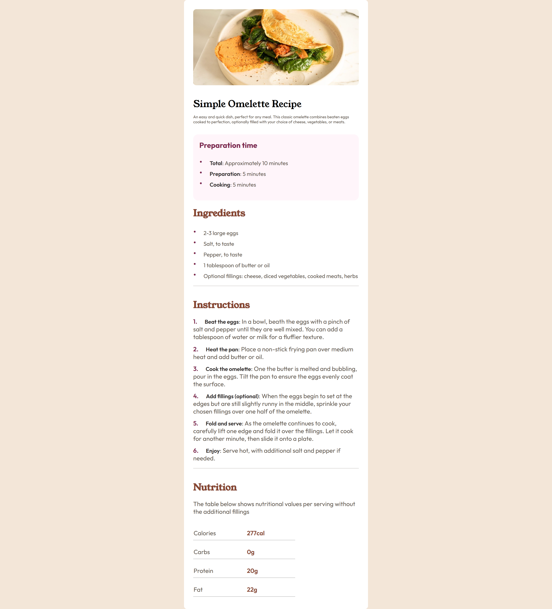

# Frontend Mentor - Solución a la página de recetas

[English version](README.md)

Esta es una solución a la [Página de recetas en Frontend Mentor](https://www.frontendmentor.io/challenges/recipe-page-KiTsR8QQKm). Los retos de Frontend Mentor te ayudan a mejorar tus habilidades de codificación construyendo proyectos realistas.

## Tabla de contenidos

- [Resumen](#resumen)
  - [Móvil](#móvil)
  - [Escritorio](#escritorio)
  - [Enlaces](#links)
- [Mi proceso](#my-process)
  - [Construido con](#construido-con)
  - [Lo que aprendí](#lo-que-aprendí)

## Resumen

### Móvil


### Escritorio



### Enlaces

- URL del sitio activo: [Live on GitHub.io](https://alchrdev.github.io/recipe-page/)

## Mi proceso

### Construido con

- HTML5 semántico
- Custom properties
- Grid CSS
- Flujo de trabajo mobile-first

### Lo que aprendí

Aprendí sobre el uso de la propiedad css `counter-reset` y `counter-increment`. Esto fue necesario para realizar el "truco" al estilizar la lista ordenada. Ya que estas, al igual que las desordenadas, no tienen opción de cambiar su color y tamaño. Y por supuesto, también gracias al pseudoelemento `::before`.

Para ello pensé en varias formas, entre ellas la de "simularlos" usando `span` o `div`. Sin embargo, al final me decidí por el método mencionado. ¿Fue la "elección correcta"? Me gustaría leer sus sugerencias u otras posibles soluciones.

```html
<ul class="recipe-preparation__list">
  <li class="recipe__bullets"></li>
  <li class="recipe__bullets"></li>
  <li class="recipe__bullets"></li>
  <li class="recipe__bullets"></li>
  <li class="recipe__bullets"></li>
</ul>

<ol class="recipe-instructions__list">
  <li class="recipe__numbers"></li>
  <li class="recipe__numbers"></li>
  <li class="recipe__numbers"></li>
  <li class="recipe__numbers"></li>
  <li class="recipe__numbers"></li>
</ol>
```

```css
.recipe-instructions__list {
  counter-reset: item;
}

.recipe__bullets,
.recipe__numbers {
  color: var(--neutral-wenge-brown);
  list-style-type: none;
}

.recipe__bullets::before {
  content: '•';
  color: var(--primary-dark-raspberry);
  display: inline-block;
  block-size: 1.3rem;
  margin-right: 1rem;
  font-size: 1.5rem;
}

.recipe__numbers::before {
  counter-increment: item;
  content: counter(item) '.';
  color: var(--primary-dark-raspberry);
  block-size: 1.3rem;
  margin-inline-end: 1rem;
  font-size: 1rem;
  font-weight: 600;
}
```

### Desarrollo continuo

- Todavía no me siento cómodo nombrando propiedades personalizadas. Quiero poder seguir algún tipo de "estándar" y poder replicarlo en cada uno de mis proyectos. Además, que al mismo tiempo puedan ser legibles y comprensibles para cualquiera que lea e interprete el código.

- ¿Hay alguna forma de utilizar "eficientemente" las clases de utilitarias?

- En cuanto al diseño responsivo, ¿he hecho "bien" en utilizar un media querie con líneas de rejilla? Es decir, también podría haber asignado una anchura máxima al contenedor, pero me pareció que podría estar limitando el contenido. Sería estupendo recibir una respuesta al respecto. Muchas gracias.

### Recursos útiles

- [MDN - counter-reset](https://developer.mozilla.org/en-US/docs/Web/CSS/counter-reset)
- [MDN - counter-increment](https://developer.mozilla.org/en-US/docs/Web/CSS/counter-increment)

## Autor

- Frontend Mentor - [@alchrdev](https://www.frontendmentor.io/profile/alchrdev)
- Twitter - [@alchrdev](https://www.twitter.com/alchrdev)
